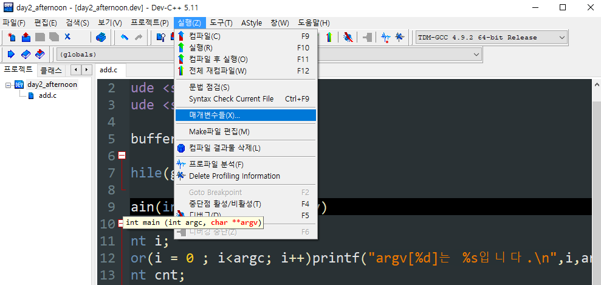

# argc와 argv

> C 언어에서 main 함수는 프로그램이 최초로 실행되는 곳. 또, 매개변수는 함수를 호출할 때 전달되는 데이터를 의미하는데 main 함수의 역시 매개변수가 존재한다.

### 일반적인 main 함수
```c
int main (void){
...
}
```

### 매개변수가 있는 main 함수
```c
int main(int argc, char ** argv){
...
}
```

## Parameters
main() 함수의 파라미터에는,

1. int argc : main()함수에 전달되는 데이터 개수
2. char ** argv : char * arv[]라고도 표헌. main()함수에 전달되는 실제 데이터로 char형 포인터 배열로 구성되어있음.

## 인자에 아무 것도 전달하지 않는 경우

```int main(int argc, char** argv){
	int i;
	for(i = 0 ; i< argc ; i++)
	{
		printf("argv[%d]는 %s입니다.\n", i, argv[i);
	}
}
```

### 결과


1. argc는 개수를 나타냄
2. argv의 [0]번째 인자에는 default로 경로가 지정되어있다.

## Parse parameter

그렇다면, 과제에서 처럼 main.exe 117 4를 매개변수로 넘겨야 한다면 어떻게 해야 할 까?

나는 `dev C/C++` 툴로 과제를 진행하고 있기에 해당 솔루션을 수행하겠다.

### 실행 > 매개변수들(X)



### 실행 결과


매개변수에 main, 117, 4가 잘 들어간 것을 볼 수 있다.


---

## Reference
https://qzqz.tistory.com/177
https://m.blog.naver.com/jsky10503/221203136166